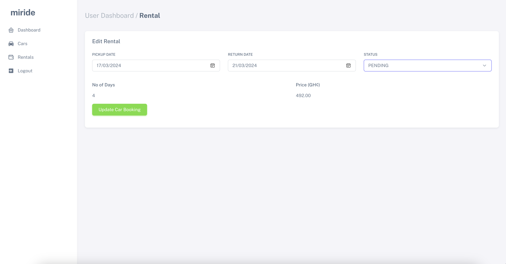

# MiRide
- [MiRide](#miride)
  - [Introduction](#introduction)
    - [Problem](#problem)
    - [Solution](#solution)
    - [Benefit](#benefit)
    - [Live Project](#live-project)
    - [Blog](#blog)
    - [Authors](#authors)
  - [Installation](#installation)
    - [Pre-requisites](#pre-requisites)
    - [Installation Process](#installation-process)
  - [Usage](#usage)
    - [Screenshots](#screenshots)
      - [Landing Page](#landing-page)
      - [User Dashboard](#user-dashboard)
      - [Update Rental](#update-rental)
      - [Admin Dashboard -  Delete Item](#admin-dashboard----delete-item)
      - [Vendor - Add Car](#vendor---add-car)
  - [Contributing](#contributing)
  - [Related projects](#related-projects)
  - [Licensing](#licensing)

## Introduction
### Problem
Imagine a foreigner who travels to Ghana for tourism or to visit someone. Finding a car to use becomes a challenge sometimes. Issues of fraud and renting out faulty vehicles have been major issues these travellers face.

### Solution
Provide a seamless platform for tourists to rent cars to explore Ghana with ease, and contribute to the local economy

### Benefit
Experience the freedom of the open road with our reliable and affordable car rentals, making every journey an unforgettable adventure tailored to your needs

Unlock the Road to Adventure: Your journey, Your car, Your way - Rent with confidence

### Live Project
Our project is deployed and is live at [http://142.93.47.175](http://142.93.47.175/)

### Blog
Find our blog post on medium for the project at [Miride](https://medium.com/@edmundmensah422/the-construction-of-miride-a-journey-8e9a5cc7b291)

### Authors
- Dr. (Med) Schandorf Osam-Frimpong - [LinkedIn](https://www.linkedin.com/in/schandorf-osam-frimpong-md-290958192) | [Github](https://gitub.com/osamfrimpong)
- Mr. Edmund Adanor Mensah  - [LinkedIn](https://www.linkedin.com/in/edmund-mensah-2781861a8?utm_source=share&utm_campaign=share_via&utm_content=profile&utm_medium=ios_app) | [Github](https://github.com/mr-mensah)

## Installation
### Pre-requisites
1. MySQL or Postgres
2. NodeJS version >= 18
3. NPM version >=10

### Installation Process
1. Clone the repository
```
git clone  https://github.com/osamfrimpong/miride.git
```
2. Change directory into the project folder
```
cd miride
```
3. Install node modules and packages
```
npm install
```
4. Create .env file from .env.example
```
cp .env.example .env
```
5. Update the environment variables in the .env file


## Usage
1. Run the project in development mode with watching for changes. Use link generated in the terminal to launch the project.
```
npm run dev
```
2. Build for production. The production code goes into the build folder.
```
npm run build --production or npm run build
```
3. Run the project in production mode. Use link generated in the terminal to launch the project.
```
npm run start
```

### Screenshots
#### Landing Page

#### User Dashboard


#### Update Rental


#### Admin Dashboard -  Delete Item


#### Vendor - Add Car


## Contributing
Pull requests are welcome. 

For major changes, please open an issue first
to discuss what you would like to change.

For minor changes, please clone or fork this repository, create a branch with the neccessary changes and make a pull request.

Please make sure to update tests where neccessary or appropriate.

## Related projects

## Licensing
This is an open source project which can be modified and adapted for personal and commercial use. It is licensed with the [MIT](https://choosealicense.com/licenses/mit/) license.
